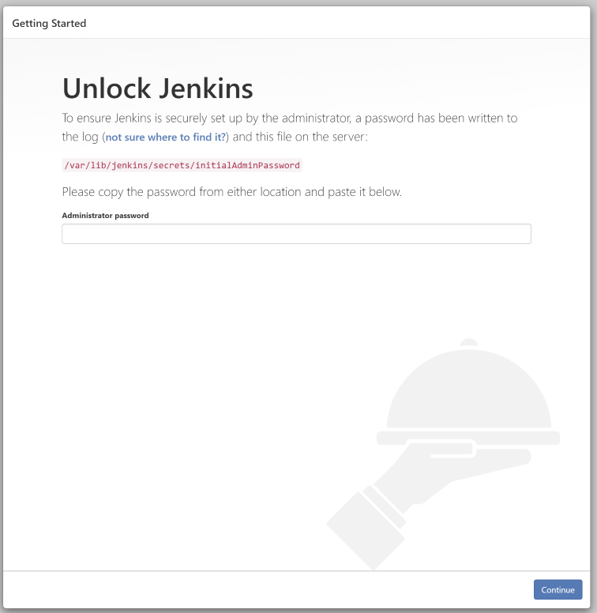
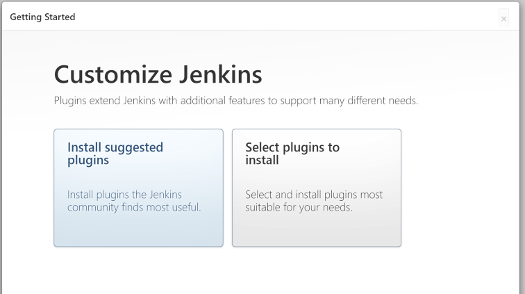

# Jenkins Centos7에 설치 및 구성
## 실습 서버 정보
- OS: Centos7
- CPU: 6 core
- Memory: 12Gi
- 가상머신 툴: Oracle Virtualbox
- 할당 IP: 192.168.56.50

### Jenkins Install
``` bash
sudo wget -O /etc/yum.repos.d/jenkins.repo \
    https://pkg.jenkins.io/redhat-stable/jenkins.repo
sudo rpm --import https://pkg.jenkins.io/redhat-stable/jenkins.io.key
sudo yum upgrade
sudo yum install epel-release java-11-openjdk-devel
sudo yum install jenkins
sudo systemctl daemon-reload
sudo systemctl start jenkins
```

### Jenkins 방화벽 설정
``` bash
YOURPORT=8080
PERM="--permanent"
SERV="$PERM --service=jenkins"

firewall-cmd $PERM --new-service=jenkins
firewall-cmd $SERV --set-short="Jenkins ports"
firewall-cmd $SERV --set-description="Jenkins port exceptions"
firewall-cmd $SERV --add-port=$YOURPORT/tcp
firewall-cmd $PERM --add-service=jenkins
firewall-cmd --zone=public --add-service=http --permanent
firewall-cmd --reload
```

### Jenkins 접속
1. 접속 URL: 192.168.56.50:8080
  


2. 초기 비밀번호 확인
  ```
  sudo cat /var/lib/jenkins/secrets/initialAdminPassword
  # ex) cbd5db460f2441178ae65fa9928765e0
  ```
3. 초기 구성 시 설치할 plugin 선택
  - 해당 실습에서는 Install suggested plugins를 클릭하여 진행합니다.



4. Admin User 생성
   - Id: admin, Password: admin으로 생성 진행합니다.


5. Jenkins 설정 완료
   - 구성이 완료되면 다음과 같은 메인페이지가 출력됩니다.


