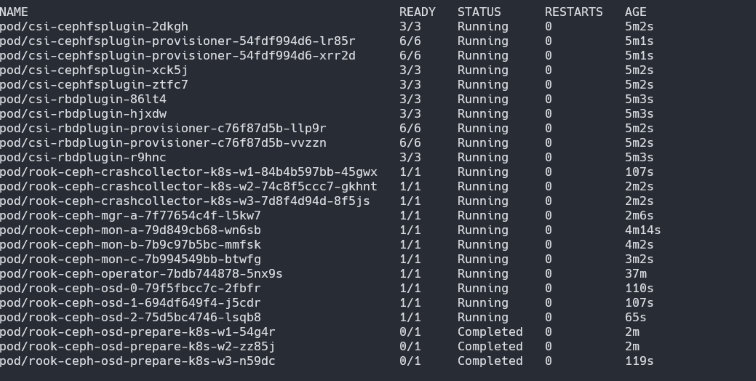

# Rook Ceph Install

- https://rook.io/

- rook ceph 1.7 버전으로 진행합니다.

### Rook Ceph Git

``` bash
git clone --single-branch --branch release-1.7 https://github.com/rook/rook.git
```

### Deploy the Rook Operator

``` bash
cd cluster/examples/kubernetes/ceph
kubectl create -f crds.yaml -f common.yaml -f operator.yaml
```

### Disk 정리

- Ceph 스토리지 클러스터 구성 시
  - LVM2가 설치되어 있어야 합니다.
  - 파티션 설정이 안 되어 있어야 합니다.
- LVM2 설치

``` bash
sudo yum install lvm2
```

- Disk 정리

```bash
#!/usr/bin/env bash

# ceph 으로 사용할 Disk를 기입
disk_arr=(b c d e f g h i j k)

echo disk reset...

for disk in ${disk_arr[@]}; do
  DISK=/dev/sd$disk
  wipefs -a $DISK
  sgdisk --zap-all $DISK
  dd if=/dev/zero of="$DISK" bs=1M count=100 oflag=direct,dsync
  blkdiscard $DISK
done
rm -rf /dev/ceph-*

echo disk reset end
```

### Cluster 배포

- cluster.yaml 수정
  - 현재 실습에서 dashboard를 ssl 없이 접속하기 때문에 ssl를 disable 시켜줍니다.
    - spec.dashboard.ssl: false
  - ceph disk를 disk가 있는 node와 disk 정보를 입력합니다.
    - 현재 실습에서 k8s-w1, k8s-w2, k8s-w3 3개의 노드에 ceph을 구성하고 disk는 sdb를 사용합니다.
    - 모든 노드를 확인하여 모든 디스크를 ceph으로 구성하는 옵션을 false 시킵니다.
      - spec.storage.useAllnodes: false
      - spec.storage.useAllDevices: false
    - node 및 disk를 선택합니다.
      - spec.storage.config.nodes.0.name: "k8s-w1"
      - spec.storage.config.nodes.0.devicees.0.name: "sdb"
      - spec.storage.config.nodes.1.name: "k8s-w2"
      - spec.storage.config.nodes.1.devicees.0.name: "sdb"
      - spec.storage.config.nodes.2.name: "k8s-w3"
      - spec.storage.config.nodes.2.devicees.0.name: "sdb"

- cluster.yaml를 배포합니다.

  ``` bash
  kubectl apply -f cluster.yaml
  ```

- 배포 완료 시 이미지와 같이 osd가 생성 완료됩니다.


