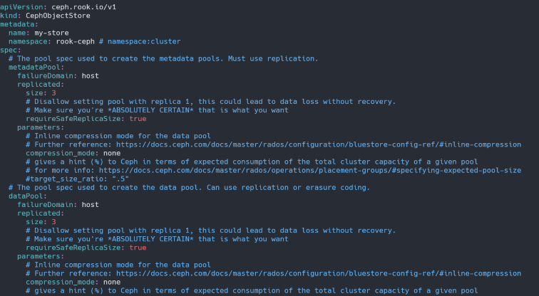
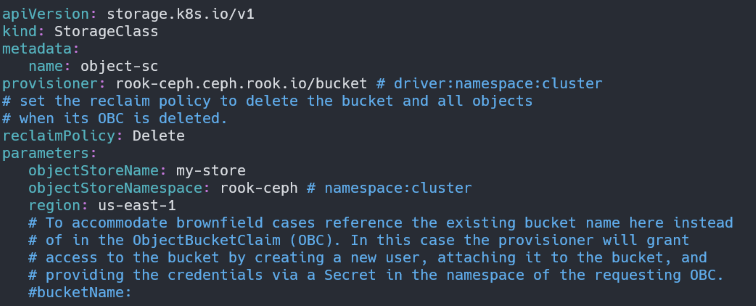

# Object Storage 구성
### object.yaml 수정
- object store의 이름을 변경합니다.
- metadataPool은 object의 config 데이터이고 dataPool이 object data를 저장하는 공간입니다.
- 3개의 호스트에 replicated를 설정하가 위해 failureDomain은 host로 replicated.size는 3으로 기존 설정 그대로 설정합니다.
- dataPool도 동일하게 failureDomain은 host로 replicated.size는 3으로 기존 설정 그대로 설정합니다.

    

### Object StorageClass 생성
- storageclass-bucket-delete.yaml
- storageClass name과 objectStoreName 변경 후 배포합니다.

    

    ``` bash
    kubectl apply -f storageclass-bucket-delete.yaml
    ```
