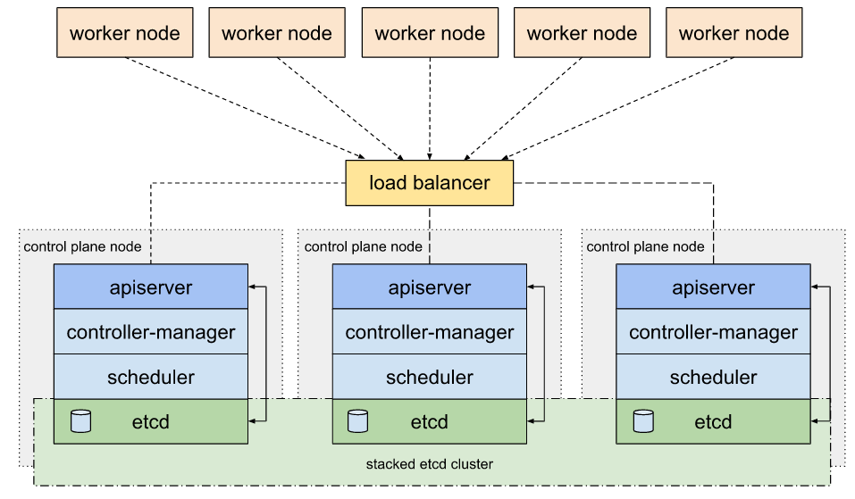

# Kubernetes HA

## 진행 내용



- 쿠버네티스 HA(고가용성) 구성 설치
- 애플리케이션단의 prxoy를 구성이 아닌 물리적인 L4장비 사용
- L4 장비 1대, Master 3대, Worker 3대 구성
- 설치 버전
  - Linux: Centos7
  - docker version: 20.10.7
  - kubernetes version: 1.20.2

## Centos7 설정

1. 방화벽 중단

   ```bash
   sudo systemctl disable firewalld && sudo systemctl stop firewalld
   ```

2. selinux disabled

   ```bash
   # selinux 상태 확인
   sestatus
   
   # selinux disabled
   sudo setenforce 0
   sudo sed -i 's/^SELINUX=enforcing$/SELINUX=permissive/' /etc/selinux/config
   
   # disabled 안될 시 해당 방법으로 진행
   sudo vi /etc/sysconfig/selinux
   ...
   "SELINUX=disabled" # 변경
   ...
   ```

3. Swap off

   ```bash
   swapoff -a && sed -e '/swap/ s/^#*/#/' -i /etc/fstab
   ```

4. iptables 설정

   ```bash
   cat <<EOF | sudo tee /etc/modules-load.d/k8s.conf
   br_netfilter
   EOF
   
   cat <<EOF | sudo tee /etc/sysctl.d/k8s.conf
   net.bridge.bridge-nf-call-ip6tables = 1
   net.bridge.bridge-nf-call-iptables = 1
   EOF
   sudo sysctl --system
   ```

5. base package 설치

   ```bash
   sudo yum install yum-utils bind-utils wget bash-completion git jq -y
   
   # ceph storage 구성 시 설치
   sudo yum install lvm2 -y
   ```

## Docker install

1. yum repository 등록

   ```bash
   sudo yum-config-manager \\
       --add-repo \\
       <https://download.docker.com/linux/centos/docker-ce.repo>
   ```

2. install

   ```bash
   sudo yum install -y docker-ce docker-ce-cli containerd.io
   
   sudo systemctl start docker
   sudo systemctl enable docker
   ```

3. cgroup 관리 systemd 설정

   ```bash
   sudo mkdir /etc/docker
   cat <<EOF | sudo tee /etc/docker/daemon.json
   {
     "exec-opts": ["native.cgroupdriver=systemd"],
     "log-driver": "json-file",
     "log-opts": {
       "max-size": "100m"
     },
     "storage-driver": "overlay2"
   }
   EOF
   
   sudo systemctl enable docker
   sudo systemctl daemon-reload
   sudo systemctl restart docker
   ```

4. 동작 확인 필요 시

   ```bash
   sudo docker run hello-world
   ```

## Kubernetes install

1. yum repository 등록

   ```bash
   cat <<EOF | sudo tee /etc/yum.repos.d/kubernetes.repo
   [kubernetes]
   name=Kubernetes
   baseurl=https://packages.cloud.google.com/yum/repos/kubernetes-el7-\\$basearch
   enabled=1
   gpgcheck=1
   repo_gpgcheck=1
   gpgkey=https://packages.cloud.google.com/yum/doc/yum-key.gpg <https://packages.cloud.google.com/yum/doc/rpm-package-key.gpg>
   exclude=kubelet kubeadm kubectl
   EOF
   ```

2. install

   ```bash
   sudo yum install -y kubelet-1.20.2 kubeadm-1.20.2 kubectl-1.20.2 --disableexcludes=kubernetes
   sudo systemctl enable --now kubelet
   ```


## Kubernets 클러스터 구성

1. Init (하나의 Master 노드에서만 실행)

   - L4를 통해 각 마스터의 6443포트로 통신 가능해야합니다.
   - init 완료 시 출력되는 kubadm join... 명령어는 저장해 둡니다.

   ```bash
   kubeadm init --control-plane-endpoint "<LoadBalancer DNS/IP>:port" \\
                   --upload-certs \\
                   --pod-network-cidr "192.168.0.0/16"
   ```

   - kubeadm join ... 명령어에서 —control-plan —certificate-key flag가 추가되어있는 명령어는 master 노드 join하기 위한 명령어이며, 해당 flag가 없는 명령어가 worker 노드 join을 위한 명령어입니다.

2. Kubernetes 네트워크 플러그인 Calico 배포

   ```bash
   wget <https://docs.projectcalico.org/v3.14/manifests/calico.yaml>
   
   # 주석 설정을 풀어줍니다.
   vi calico.yaml
   ... line 672 ...
   - name: CALICO_IPV4POOL_CIDR
   	value: "192.168.0.0/16"
   
   # kubernetes 배포
   kubectl apply -f calico.yaml
   ```

3. Master Join (Init을 한 master를 제외하고 진행)

   ```bash
   kubeadm join <LoadBalancer DNS/IP>:port --token ... \\
       --discovery-token-ca-cert-hash ... \\
       --control-plane --certificate-key ...
   ```

4. Worker Join

   ```bash
   kubeadm join <LoadBalancer DNS/IP>:port --token ... \\
       --discovery-token-ca-cert-hash ...
   ```

### TODO:

- LoadBalancer로 HAproxy 변경하여 HA 구성 진행
