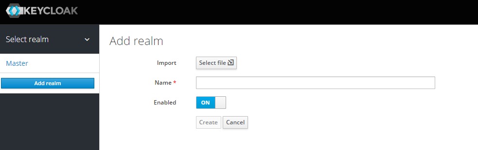
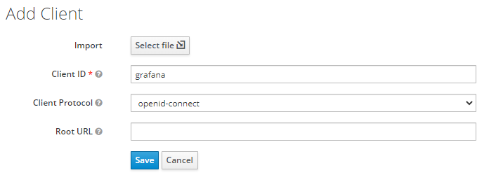
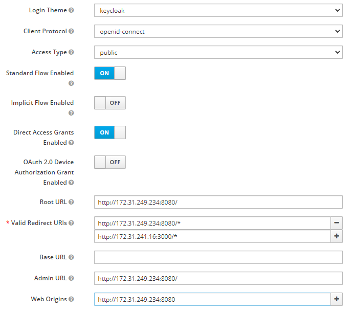
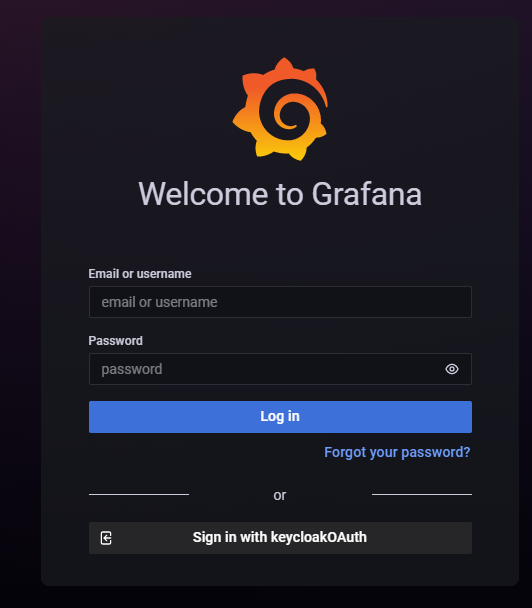

# Grafana OAuth Configure

- Grafana OIDC 구성
- OIDC Provider: keycloak

### Prerequisites

- Hyper-v 가상머신을 사용하여 두 개의 서버 구성
  - keycloak: 172.31.249.234, ubuntu20.4, 2core, 4Gi
  - grafana: 172.31.241.16, ubuntu20.4, 2core, 4Gi
- 구성 후 docker를 이용하여 실행
- docker version: 20.10.10
- keycloak version: 15.0.2
- grafana version: 8.2.2

## Keycloak Configure

- keycloak container 실행
- port: 8080, user: admin, password: admin으로 구성
- site access: http://172.31.249.234:8080

```bash
docker run -d -p 8080:8080 -e KEYCLOAK_USER=admin -e KEYCLOAK_PASSWORD=admin --name keycloak quay.io/keycloak/keycloak:15.0.2
```

### KeyCloak realm create

- 우측 상단 Master에 마우스 커서 이동 후 Add realm 클릭
- Name 입력 후 create 클릭
- 해당 실습에서는 Basic 으로 진행



### Keycloak client 생성 및 설정 추가

- Menu - Configure - Clients - Create 클릭
- Client ID 입력 후 Save 클릭



- 설정 Save하면 Settings창으로 이동됩니다.
- 이미지와 같이 setting 후 Save 클릭 (grafana port: 3000)



## Grafana configure

- grafana docker로 실행 시 grafana.ini 파일의 설정을 변경 하지 않고 environment를 통해 옵션을 설정할 수 있습니다.

- env 설정 시 구문: GF_<sectionName>__<KeyName>

  - env key name은 대문자로 기입합니다.

- oauth 설정 시 grafana.ini

  ```ini
  ...
  [server]
  domain=172.31.241.16
  
  [auth.generic_oauth]
  enabled = true
  client_id = basic
  client_secret = YOUR_APP_CLIENT_SECRET
  scopes = profile,openid,email,offline_access
  auth_url = http://172.31.249.234:8080/auth/realms/basic/protocol/openid-connect/auth
  token_url = http://172.31.249.234:8080/auth/realms/basic/protocol/openid-connect/token
  api_url = http://172.31.249.234:8080/auth/realms/basic/protocol/openid-connect/userinfo
  allow_sign_up = true
  ```

### Grafana Docker Start

- docker를 사용하여 grafana 실행
- url: http://172.31.241.16:3000으로 접속 후 Sign in with keycloakOAuth를 클릭하여 로그인합니다.

```bash
docker run -d -p 3000:3000 --name grafana \
-e GF_SERVER_DOMAIN=172.31.241.16 \
-e GF_AUTH_GENERIC_OAUTH_ENABLED=true \
-e GF_AUTH_GENERIC_OAUTH_NAME=keycloakOAuth \
-e GF_AUTH_GENERIC_OAUTH_ALLOW_SIGN_UP=true \
-e GF_AUTH_GENERIC_OAUTH_CLIENT_ID=grafana \
-e GF_AUTH_GENERIC_OAUTH_CLIENT_SECRET= ... \
-e GF_AUTH_GENERIC_OAUTH_SCOPES=profile,openid,email,offline_access \
-e GF_AUTH_GENERIC_OAUTH_AUTH_URL=http://172.31.249.234:8080/auth/realms/basic/protocol/openid-connect/auth \
-e GF_AUTH_GENERIC_OAUTH_TOKEN_URL=http://172.31.249.234:8080/auth/realms/basic/protocol/openid-connect/token \
-e GF_AUTH_GENERIC_OAUTH_API_URL=http://172.31.249.234:8080/auth/realms/basic/protocol/openid-connect/userinfo \
grafana/grafana:8.2.2
```

