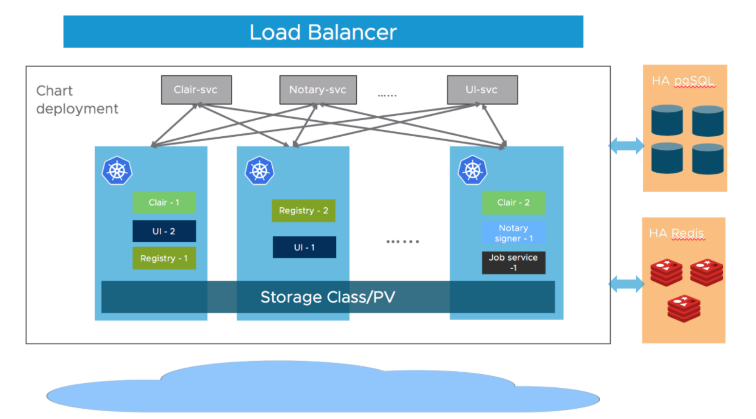
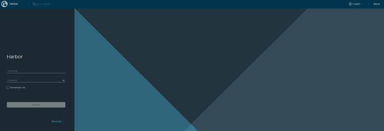

# Harbor helm install

## Prerequisites
- Kubernetes cluster 1.10+
- Helm 2.8.0+
- High available ingress controller (Harbor does not manage the external endpoint)
- High available PostgreSQL 9.6+ (Harbor does not handle the deployment of HA of database)
- High available Redis (Harbor does not handle the deployment of HA of Redis)
- PVC that can be shared across nodes or external object storage

## Architecture

- 현재 실습에서는 외부 PostgreSQL, Redis 사용하지 않고 Helm으로 설치되는 PostgreSQL, Redis를 사용합니다.



## Helm Repo add
```bash
helm repo add harbor https://helm.goharbor.io
helm repo update
```

## Helm values
```bash
helm show values harbor/harbor > harbor_values.yaml
```

## HTTPS 액세스를 위한 TLS 생성
- Domain 사용을 위해 /etc/hosts에 192.168.56.11 *.harbor.com
1. CA 인증서 생성
   - CA 인증서 개인 키를 생성합니다.
    ```bash
    openssl genrsa -out ca.key 4096
    ```
   - CA 인증서를 생성합니다.
     - FQDN을 사용하여 하버 호스트에 연결하는 경우 이를 일반 이름(CN) 속성 으로 지정해야 합니다.
    ```bash
    openssl req -x509 -new -nodes -sha512 -days 3650 \
        -subj "/C=CN/ST=SEOUL/L=SEOUL/O=example/OU=Personal/CN=harbor.com" \
        -key ca.key \
        -out ca.crt
    ```
2. 서버 인증서 생성
   - 개인 키를 생성합니다.
    ```bash
    openssl genrsa -out harbor.com.key 4096
    ```
   - CSR을 생성합니다.
     - FQDN을 사용하여 하버 호스트에 연결하는 경우 이를 일반 이름(CN) 속성 으로 지정해야 합니다.
    ```bash
    openssl req -sha512 -new \
    -subj "/C=CN/ST=SEOUL/L=SEOUL/O=example/OU=Personal/CN=harbor.com" \
    -key harbor.com.key \
    -out harbor.com.csr
    ```
  - x509 v3 확장 파일을 생성합니다.
    ```bash
    cat > v3.ext <<-EOF
    authorityKeyIdentifier=keyid,issuer
    basicConstraints=CA:FALSE
    keyUsage = digitalSignature, nonRepudiation, keyEncipherment, dataEncipherment
    extendedKeyUsage = serverAuth
    subjectAltName = @alt_names
    
    [alt_names]
    DNS.1=harbor.com
    DNS.2=harbor
    EOF
    ```
  - v3.ext 파일을 사용하여 Harbor 호스트에 대한 인증서를 생성합니다.
    ```bash
    openssl x509 -req -sha512 -days 3650 \
    -extfile v3.ext \
    -CA ca.crt -CAkey ca.key -CAcreateserial \
    -in harbor.com.csr \
    -out harbor.com.crt
    ```
3. docker에서 Harbor 레지스트리 접근 가능하도록 인증서 이동
   - Docker 데몬은 .crt 파일을 CA 인증서로 해석하고 .cert 파일을 클라이언트 인증서로 해석합니다.
   - crt를 cert로 변환합니다.
    ```bash
    openssl x509 -inform PEM -in harbor.com.crt -out harbor.com.cert
    ```
   - 서버 인증서, 키 및 CA파일을 harbor 호스트에 docker 인증서 폴더에 복사합니다.
    ```bash
    mkdir -p /etc/docker/certs.d/harbor.com
    cp harbor.com.cert /etc/docker/certs.d/harbor.com/
    cp harbor.com.key /etc/docker/certs.d/harbor.com/
    cp ca.crt /etc/docker/certs.d/harbor.com/
    ```

4. kubernetes tls secret 생성
    ```bash
    kubectl create ns harbor-system
    
    kubectl create secret tls harbor-tls-secret \
        -n harbor-system \
        --cert=/root/tls/harbor.com.cert \
        --key=/root/tls/harbor.com.key
    ```

## Helm Harbor 실행
- 별도의 storageClass 및 pv,pvc를 생성은 진행하지 않아 persistence disalbe합니다.
```bash
helm install --namespace harbor-system --create-namespace \
	harbor harbor/harbor \
    --set expose.secretName=harbor-tls-secret \
    --set expose.ingress.hosts.core=core.harbor.com \
    --set expose.ingress.hosts.notary=notary.harbor.com \
    --set externalURL=https://core.harbor.com \
    --set persistence.enabled=false \
    --set harborAdminPassword=admin
```

## Harbor portal 접속
- https://core.harbor.com



## Harbor Persistence 설정

- aws s3, ceph object storage 등 object storage에 이미지 데이터 저장 설정

- persistence volume storage class 설정

- container image push 시 연동한 object storage에 저장됩니다.

  ```bash
  helm install --wait harbor --namespace harbor-system harbor/harbor \
      --set persistence.enabled=true \
  	--set persistence.persistentVolumeClaim.registry.storageClass=[storage class] \
      --set persistence.persistentVolumeClaim.chartmuseum.storageClass=[storage class] \
      --set persistence.persistentVolumeClaim.jobservice.storageClass=[storage class] \
      --set persistence.persistentVolumeClaim.database.storageClass=[storage class] \
      --set persistence.persistentVolumeClaim.redis.storageClass=[storage class] \
      --set persistence.persistentVolumeClaim.trivy.storageClass=[storage class] \
      --set persistence.imageChartStorage.type=s3 \
      --set persistence.imageChartStorage.s3.bucket=[bucket name] \
      --set persistence.imageChartStorage.s3.accesskey=[access key] \
      --set persistence.imageChartStorage.s3.secretkey=[secretkey] \
      --set persistence.imageChartStorage.s3.regionendpoint=[endpoint] \
      --set externalURL=https://core.harbor.com \
      --set harborAdminPassword=admin
  ```

## Ingress 설정

- ingress tls 설정을 위해 secret tls를 먼저 생성 후 진행합니다.

    ```bash
    kubectl create secret tls harbor-tls -n harbor-system \
    	--cert=/root/tls/harbor.com.cert \
        --key=/root/tls/harbor.com.key
    
    helm install --wait harbor --namespace harbor-system harbor/harbor \
    	--set expose.ingress.hosts.core=core.harbor.com \
        --set expose.ingress.hosts.notary=notary.harbor.com \
        --set expose.tls.certSource=secret \
        --set expose.tls.secret.secretName=harbor-tls \
        --set expose.tls.secret.notarySecretName=harbor-tls \
    ```

## Reference

- https://goharbor.io/docs/2.3.0/install-config/harbor-ha-helm/
