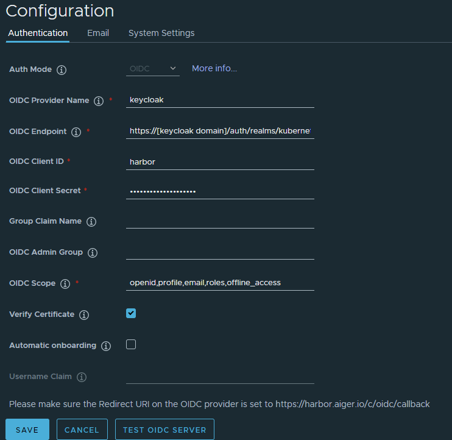
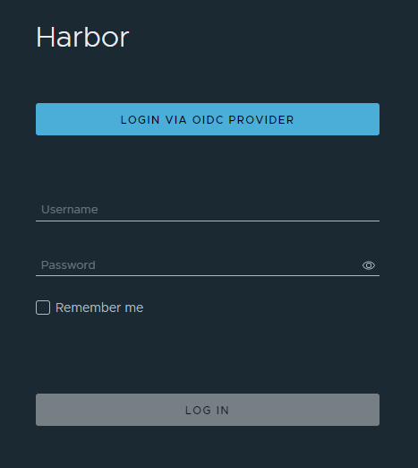

# Harbor OIDC

- Harbor OIDC 구성

- oidc provider: keycloak

- keycloak 메뉴얼에서 kubernetes로 배포하는 keycloak operator를 설치와 realm을 생성합니다.

- harbor를 연결한 client를 생성합니다.

- 해당 실습에서 client의 yaml을 아래와  같이 설정 후 생성했습니다.

  ```yaml
  apiVersion: keycloak.org/v1alpha1
  kind: KeycloakClient
  metadata:
    name: harbor
    labels:
      realm: kubernetes-keycloakrealm
  spec:
    realmSelector:
      matchLabels:
        realm: kubernetes-keycloakrealm
    client:
      clientId: harbor
      # openssl rand -hex 32 | base64
      secret: YmI5ZGI2ZWI5NWNmNjk4ZjI3ZDViNTFjYTdiNzk2YzIwOTg1MDNiZDU1YmU5MTE1OWJmNTE4NGNkZGE1MGIzMAo=
      clientAuthenticatorType: client-secret
      protocol: openid-connect
      enabled: true
      redirectUris:
        - https://[harbor domain]/c/oidc/callback
        - https://[keycloak domain]/*
      rootUrl: https://[keycloak domain]/
      adminUrl: https://[keycloak domain]/
      webOrigins: 
        - "*"
      defaultClientScopes:
        - roles
        - email
        - profile
        - web-origins
      optionalClientScopes:
        - address
        - microprofile-jwt
        - offline_access
        - phone
      # publicClient: true
      standardFlowEnabled: true
      directAccessGrantsEnabled: true
  ```

## Harbor OIDC 설정

- harbor dashboard에 접속하여 관리자 계정으로 로그인합니다.
- 메뉴 Configuration을 클릭하여 Authentication을 선택합니다.
- Auth Mode를 OIDC로 선택 후 아래와 같이 설정을 진행합니다.
- user가 정보가 있는 경우 Auth Mode 변경이 불가능하여 user를 비어주시고 진행해야합니다.



## Harbor OIDC Login

- 설정이 완료되면 Harbor dashboard 로그인 화면에 LOGIN VIA OIDC PROVIDER 버튼이 생성됩니다.



